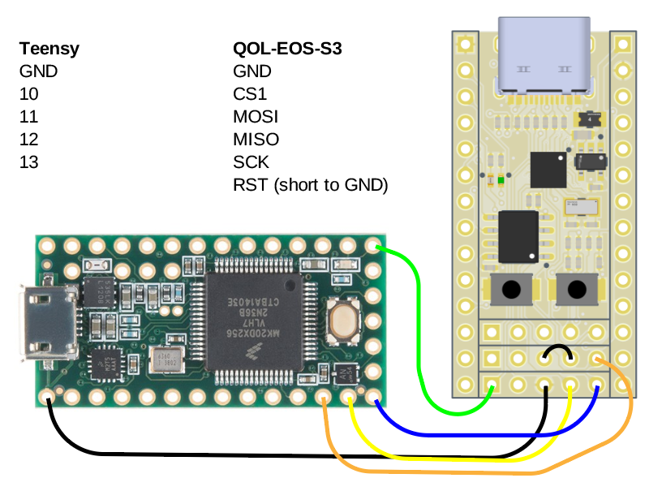

# Advanced topics

## Reprogramming the SPI flash

### Introduction
The EOS-S3 SoC does not have internal nonvolatile memory, so it boots from an external SPI flash. The breakout board has a bootloader pre-installed in the flash memory, which can be used to program the device using it's USB port. However, if the bootloader becomes corrupted for whatever reason, it can be useful to restore the whole SPI flash.

To do this, you'll need a [Teensy](https://www.pjrc.com/store/teensy32.html) with the [spiflash](https://github.com/osresearch/spiflash) firmware loaded.

First, some technical details. This is the flash memory layout that the quickfeather bootloader is expecting:

|Item                 |Status |Start      |   Size       |    End             |Start    | Size        | End     |
|-----                |-------|----------:|   ----------:|    -------------:  |--------:| ----------: | -------:|
|bootloader           |Used   |0x0000_0000|   0x0001_0000|    0x0000_FFFF     |      0  |      65,536 |  65,536 |
|bootfpga CRC         |Used   |0x0001_0000|             8|    0x0001_0007     | 65,536  |           8 |  65,544 |
|appfpga CRC          |Future |0x0001_1000|             8|    0x0001_1007     | 69,632  |           8 |  69,640 |
|appffe CRC           |Future |0x0001_2000|             8|    0x0001_2007     | 73,728  |           8 |  73,736 |
|M4app CRC            |Used   |0x0001_3000|             8|    0x0001_3007     | 77,824  |           8 |  77,832 |
|bootloader CRC       |Used   |0x0001_4000|             8|    0x0001_4007     | 81,920  |           8 |  81,928 |
|bootfpga             |Used   |0x0002_0000|   0x0002_0000|    0x0003_FFFF     | 131,072 |     131,072 | 262,144 |
|appfpga              |Future |0x0004_0000|   0x0002_0000|    0x0005_FFFF     | 262,144 |     131,072 | 393,216 |
|appffe               |Future |0x0006_0000|   0x0002_0000|    0x0007_FFFF     | 393,216 |     131,072 | 524,288 |
|M4app                |Used   |0x0008_0000|   0x0006_E000|    0x000E_DFFF     | 524,288 |     450,560 | 974,848 |

The hardware in the SoC only cares about the first section, which contains the bootloader. When it comes out of reset, configuration logic in the SoC reads 32 bits of data from the SPI flash location 0x120, which contains a device ID, the size of the bootloader image, and the desired SPI clock setting. If these are valid, the configuration logic then copies the bootloader into the device SRAM, and then starts the ARM processor.

Once it starts, the bootloader displays a prompt on the UART pins, then waits 5 seconds. If the user button is pressed during these 5 seconds, then it loads the bootfpga image into the FPGA, which allows the user to reprogram the device using the TinyFPGA programmer. If the button is not pressed within 5 seconds, the bootloader attempts to load the user program from the SPI flash into SRAM. It then verifies that the CRC makes (TODO: Does it actually do this?), and if it does, reconfigures the ARM to point to that code, to enter the user program.

The TLDR here is that if we want to write a raw image to the flash, we'll need at least the bootloader, bootloader CRC, bootfpga, andd bootfpga CRC sections to be present. For extra points, we can also preinstall a user app by filling the M4app and M4app CRC sections.

### Build the bootloader
First, let's build the bootloader:

    cd ~/ql-eos-s3/qorc-sdk/bl_apps/bl_bootloader/GCC_Project
    make

_TODO: what sets up the 0x120 offset in the bootloader binary?_

### Make a flash image
A tool to build a suitable image is included in the [bl apps](https://github.com/Blinkinlabs/bl_apps/blob/main/tools/build_flash_image.py). Using it with the default options will grab the bootloader binary image that we just compiled above, as well as a (for now) precompiled appfpga image:

    cd ~/ql-eos-s3/qorc-sdk/bl_apps/tools
    python3 build_flash_image.py
    added section:bootloader at:0x00000000 size:38228 crc:0x555d0a3e
    added section:bootfpga at:0x00020000 size:75960 crc:0x82fc1983
    Wrote 0xee000 bytes to image.bin

This should create a file called 'image.bin', which we can then load on the SPI flash chip, starting at offset 0.

### Flash it
Connect the Teensy to the dev board like so. Be sure to short the 'RST' pin on the board to 'GND', to prevent the SoC from booting:

_TODO: text version of the pin table_

Next, connect both the Teensy and the board to your computer using USB. Use your favorite serial terminal to connect to the Teensy. Issue the 'i' command to check if the SPI flash can be identified:

    i
    (device ID should be returned)

Now, tell the Teensy that we want to write EE000 bytes to the SPI flash, starting at offset 0. If the flash image was a different length, use that instead:

    u0 EE0000
    G 00000000 EE0000

_Note: The 'u' will not be echoed to the terminal_

Exit the serial terminal, and then use the PV command to write the image:

    pv image.bin > /dev/ttyACM0

Now, detach the Teensy, then remove the jumper between RST and GND to boot flash image.

## Attach a JTAG debugger
_TODO_

Using JTAG with the RevB board reuqires pulling up both IO_8 and IO_9, and supplying a clock to FCLK. Additionally, the 10k pullups on SWD and SCK may not be present, and would need to be added externally. A future revision will use an alternate JTAG pin mapping, to allow it to be used with the on-board oscillator.

