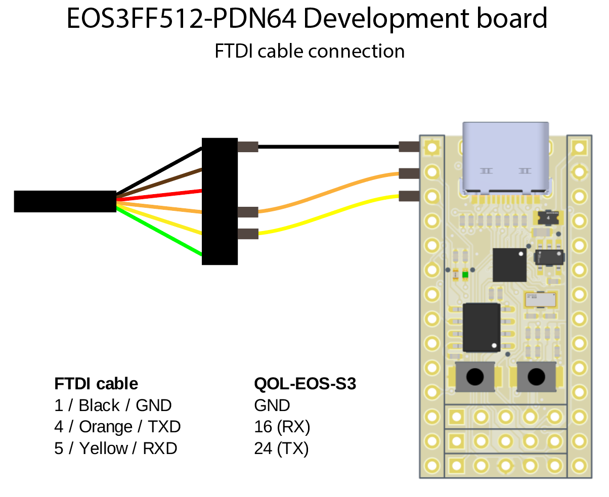

# Get Started

## Introduction
The QL-EOS-S3 board is a unique, low-cost microcontroller with a built-in FPGA.

## What you need
Hardware:

* [QL-EOS-S3 breakout board](https://github.com/Blinkinlabs/QL-EOS-S3-breakout)
* USB-C cable
* [3.3V FTDI cable](https://www.sparkfun.com/products/9717) (or other USB-serial converter)
* (optional) [Teensy 3.2](https://www.pjrc.com/store/teensy32.html), for restoring the SPI flash.
* (optional) ARM SWD adapter, such as the [Black magic probe](https://1bitsquared.com/products/black-magic-probe)

Software:

* ARM GCC toolchain, to compile code for the Cortex M4 processor
* Symbiflow toolchain, for generating FPGA bitstreams
* The QORC Software Development Kit
* Blinkinlabs example projects

## Installation

### Step 1: Install the toolchain
Follow the [toolchain setup](toolchain.md) instructions

### Step 2: Build an example project
Test a project that uses both the ARM and FPGA toolchains:

    cd ~/qorc-sdk/bl_apps/bl_helloworldhw/GCC_Project
    make

### Step 3: Flash the project
Connect your board to your computer using a USB cable, then connect an FTDI cable (technically optional):

Open your favorite serial terminal, and connect to the FTDI serial port with 115200,8N1 setting. Press the reset button on the board (the one closest to the SPI flash chip). The device should send a prompt:

    

 and then immediately after press the user button (the other one). 

And try uploading it to the board:

_Note: First put your board in bootloader mode, by pressing the RESET button, followed by the USER button_

    python3 $INSTALL_DIR/TinyFPGA-Programmer-Application/tinyfpga-programmer-gui.py --m4app output/bin/bl_helloworldhw.bin --reset
