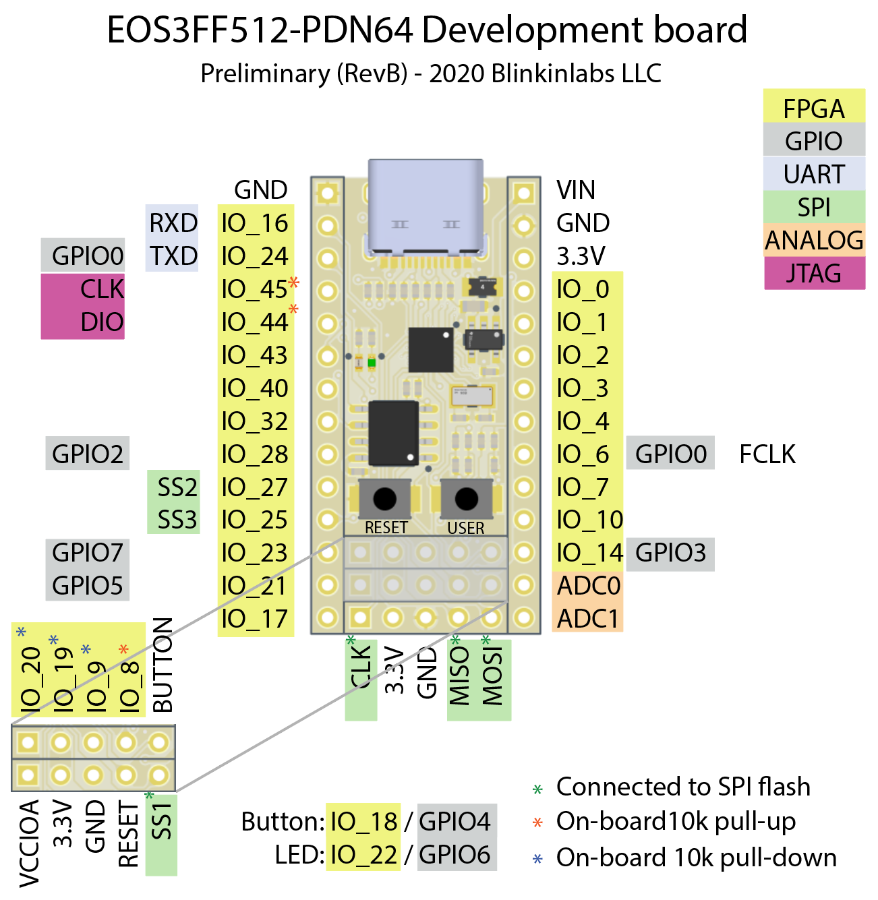

# Pinout
Compared to a normal microcontroller, the pins on the QL-EOS-S3 SoC are a little goofy. Similar to a normal microcontroller, it has some hardware GPIO pins that are attached to the ARM core, along with standard peripherals such as UART, I2C, and SPI busses, along with an analog port. Unlike a normal microcontroller, however, most of the pins are not connected to the ARM core at all! Instead, they are all connected to the FPGA core, and can be used by writing your own peripherals in Verilog.

Here is a map of all of the fixed pins on the board:

_Note: In the RevC board, some of the pins are shifted around, and ADC1 is replaced by IO_15_

_TODO: Table of available pins with alternate functions listed_
